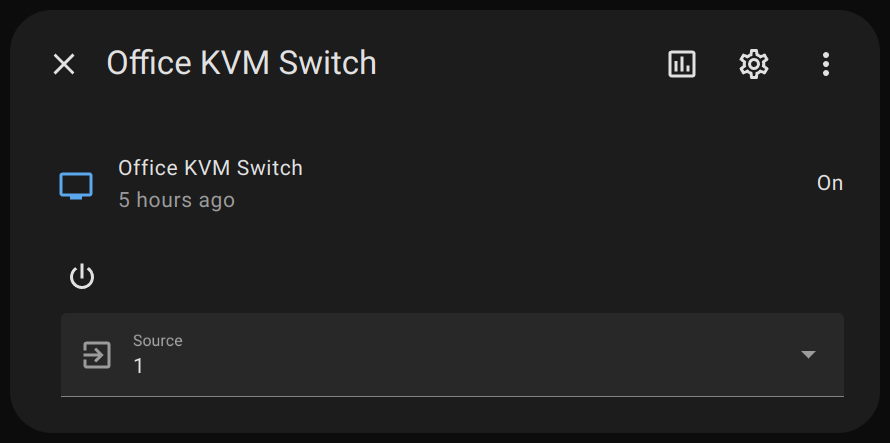

# qip-ha

qualIP Home Assistant stuff

## Standalone blueprints

- 👉 [Exterior security light control](blueprints/exterior-security-light-control.yaml)

## Kymera Wand

- 👉 [Read more about the Kymera Wand](kymera-wand/README.md)

## KVM switch media player

- 👉 [Read more about the KVM switch media player](kvm-media-player/README.md)

# Donations

---

This project is licensed under the terms of the GPL v3.0 license.
