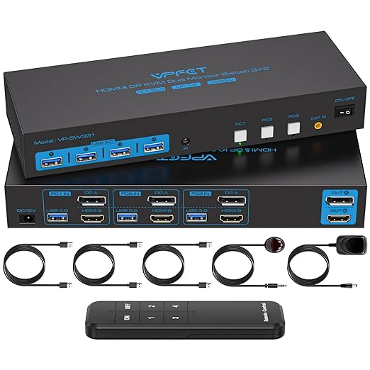
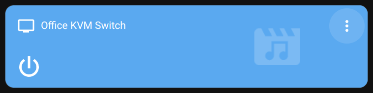
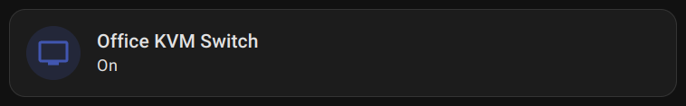
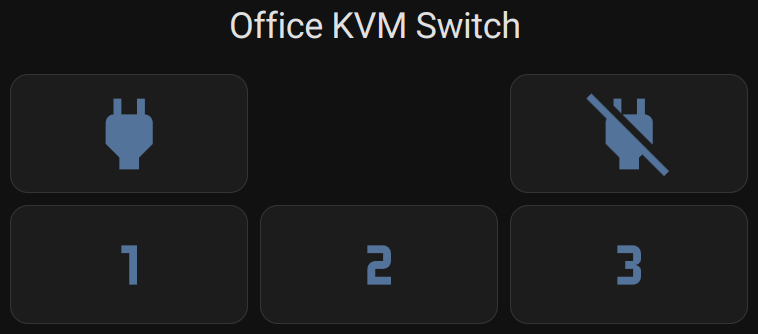

# KVM switch media player

[](https://www.paypal.com/biz/fund?id=4CZC3J57FXJVE)

## Table of Contents
- [Meet the SW223 KVM switch](#meet-the-sw223-kvm-switch)
- [End result](#end-result)
- [Requirements](#requirements)
- [Setup the KVM media player](#setup-the-KVM-media-player)
- [Use the KVM media player](#use-the-KVM-media-player)
- [Extra: State feedback using a systemd service](#extra-state-feedback-using-a-systemd-service)
- [Extra: Raw commands remote card](#extra-raw-commands-remote-card)
- [Final notes](#final-notes)
- [Donations](#donations)

## Meet the SW223 KVM switch

I bought this CMSTEDCD/VPFET SW223 KVM Switch off Amazon.ca:



Link: [VPFET SW223 KVM on Amazon.ca](https://www.amazon.ca/Displayport1-4-Monitors-Computers-Swicthes-Included/dp/B0CY1MXM8X)

High-level specs:
- Brand: [VPFET](https://vpfet.net) (Video-Perfects), also known as "CMSTEDCD"
- Output: 3 PCs
- Monitors: 2, one HDMI 2.0 and one DP 1.4
- USB 3.0
- Switch triggers: Front buttons and **Infrared**

Given the unique infrared capabilities, I couldn't pass integrating it in my Home Assistant!

## End result

Standard media player card (a bit too flashy for my taste):



[Mushroom media player card](https://github.com/piitaya/lovelace-mushroom/blob/main/docs/cards/media-player.md) (nothing fancy but more subtle):



Media player information dialog:


## Requirements

- Home Assistance instance
- KVM: VPFET SW223 KVM
- Infrared transmitter (e.g., BroadLink remote & integration)

## Setup the KVM media player

### Learn Infrared commands

Use an infrared receiver to learn the commands from the KVM's remote.
I use a BroadLink RM4 pro for this purpose.
Link: [BroadLink RM4 pro on Amazon.ca](https://www.amazon.ca/BroadLink-Universal-Learning-Entertainment-Compatible/dp/B083LBMX64)

Instructions on how to learn commands with the BroadLink integration can be found on the Home Assistant Wiki: https://www.home-assistant.io/integrations/broadlink/#learning-commands

The resulting codes can be found in "/config/.storage/broadlink_remote_xyz_codes" file (where xyz matches some unique ID of the BroadLink device).
If you're using a similar model, you can probably use my command definitions as-is:
```json
"CMSTEDCD/VPFET SW22x KVM": {
  "On": "JgBYAAABIo4WDxUQExEUEBUPFBEUDxU0FDUUNRQ0FTMVNBQ0FTQUERQQFDUUDxUQFTMVDxUQFBETNRUPFDQVNRMQFTQUNBUzFQAFEgABI0cVAAwlAAEiRxQADQU=",
  "Off": "JgBYAAABJI4VDxQQFQ8VEBQQFBAVDxQ1FDUUNBQ0FTQUNBU0FDQUERQQFDQUNRQ1EzUUEBQRFA8VNBQQFRAUEBQREzUUNBU0FAAFEAABIkcVAAwkAAEiRxUADQU=",
  "1": "JgBQAAABIJESEhITERMSEhMREhMSEhI3ETcROBI2EjcSNhI2EjcSEhMSERMSNhITEhISEhISEhMSNhI2ExISNxI2EjYSNxI3EQAFEwABIUkSAA0F",
  "2": "JgBYAAABI48VDhUQFQ8UERQPFRAUEBQ1EzUUNRQ0FTQUNBU0FDQUERQQFDQUMxYQFBETERQQFQ8UNBUQFQ8UNBU1EzUUNBU0FAAFEgABI0cUAAwoAAEiSBQADQU=",
  "3": "JgBQAAABIJATEhITERMSEhISEhMSERI4ETcRNxI3EjYSNhM2EjYSExISEzUSExM1EhMRExISEhITNRQREjcSERQ2EjYROBM1EwAFEgABIEkUAA0F",
  "4": "JgBQAAABIJETERQREhITEhIREhMRExM1EzUTNxM1EjcTNRQ0FTQTEhM1EzUVNBQ0FDUUEBQQFBEUEBQQFQ8UERQQFDUTNRQ1FAAFEAABI0cUAA0F"
}
```

Note that the KVM's remote has 4 PC buttons but the SW223 version only supports PCs 1, 2 and 3.

### Use split configuration files

The Home Assistant configuration.yaml file will undoubtedly get very big very fast if you don't split it into separate files.
See the Home Assistant Wiki for more information on splitting the configuration files: https://www.home-assistant.io/docs/configuration/splitting_configuration/

For the purpose of this KVM, the following lines will allow writing each piece to its own file:
"/config/configuration.yaml"
```yaml
input_boolean: !include input_booleans.yaml
input_select: !include input_selects.yaml
media_player: !include media_players.yaml
```

Create each of these files if they do not exist already.
### Create entities to store the KVM assumed state

Only two states need to be tracked: The On/Off "state" and the current "source". For this purpose I used the [Input select](https://www.home-assistant.io/integrations/input_select/) and [Input boolean](https://www.home-assistant.io/integrations/input_boolean/) internal integrations.

Add the content of [input_booleans.yaml](./input_booleans.yaml) to your "/config/input_booleans.yaml" file.

This boolean will have two possible states: "on" or "off"

Add the content of [input_selects.yaml](./input_selects.yaml) to your "/config/input_selects.yaml" file.

This "select" will have three possible states: "1", "2", "3". It identifies the current active source/PC of the KVM.
Note also that it has a "options" attribute containing the list of all possible options which will come handy later on.

Go to "Developer tools" and reload "INPUT BOOLEANS" and "INPUT SELECTS" or "ALL YAML CONFIGURATION".
### Scripting the interactions

Two scripts are required: one to set the KVM state ("on" or "off") and another to select a new source/PC.

#### Set state script

Setting the state requires updating the `input_boolean.kvm_state` entity to track the new assumed state and then sending the appropriate command via Infrared.
The only complication here is that sending a "On" command to the KVM when it is already on will cause it to do a quick reset. To avoid this the "On" command is only sent when the KVM state if assumed to be "off". The "Off" command can be sent safely.

Add [kvm-set-state-blueprint.yaml](./kvm-set-state-blueprint.yaml) to your "/config/blueprints/script" directory, go to "Developer tools" and reload "SCRIPTS" or "ALL YAML CONFIGURATION" then head to the "Settings / Automation & Scenes / Blueprints" page to find the "KVM: Set state" blueprint.

Click on the blueprint and fill in the fields:
- Name: KVM: Set state
- Icon: mdi:power
- Entity ID: script.kvm_set_state
- Boolean state entity: input_boolean.kvm_state
- Infrared transmitter/remote entity: remote.\<your-broadlink-entity\>
- Name of the KVM device known to the remote device: default is "CMSTEDCD/VPFET SW22x KVM"
- How long to "hold" the IR commands: default is 0.2

Hit "SAVE SCRIPT".

#### Select source script

Similar to the state script, selecting a source requires updating the `input_select.kvm_source` entity to track the new assumed source and then sending the appropriate command via Infrared.
The only complication here is that sending a "On" command to the KVM when it is already on will cause it to do a quick reset. To avoid this the "On" command is only sent when the KVM state if assumed to be "off". The "Off" command can be sent safely.

Add [kvm-select-source-blueprint.yaml](kvm-select-source-blueprint.yaml) to your "/config/blueprints/script" directory, go to "Developer tools" and reload "SCRIPTS" or "ALL YAML CONFIGURATION" then head to the "Settings / Automation & Scenes / Blueprints" page to find the "KVM: Select source" blueprint.

Click on the blueprint and fill in the fields:
- Name: KVM: Select source
- Icon: mdi:list-box
- Entity ID: script.kvm_select_source
- Selected source entity: input_select.kvm_source
- Infrared transmitter/remote entity: remote.\<your-broadlink-entity\>
- Name of the KVM device known to the remote device: default is "CMSTEDCD/VPFET SW22x KVM"
- How long to "hold" the IR commands: default is 0.2

Hit "SAVE SCRIPT".

### Put it all together in a media player entity

The [Universal media player](https://www.home-assistant.io/integrations/universal/) internal integration allows you to create or extend a entity that acts as a full-featured media player. Here I'm defining the KVM as a media player (entity ID: `media_player.kvm`) that supports turning on or off as well as selecting it's source.

Add the content of [media_players.yaml](./media_players.yaml) to your "/config/media_players.yaml" file.

I chose the "tv" device class as it's similar to my monitor being a TV and the connected PCs being its TV channels.
The `state` and `source` attributes point to the entities created above and the `source_list` just refers to the source's `options` attribute.

Commands are straight-forward, simply calling the scripts with `state` or `source` variables to use as input.

Go to "Developer tools" and reload "UNIVERSAL MEDIA PLAYER ENTITIES" or "ALL YAML CONFIGURATION".

## Use the KVM media player

Ideas how to use it:
1. Add the media player to a dash using a "Media control" or compatible card.
   This type of card will only show you a On/Off power button: You need to click elsewhere on the card to open the information page where the source selection will be available.
2. Add the `script.kvm_select_source` to a "Entities" card (not "Entity") to get a quick "RUN" button that asks for the source.
3. Create buttons, scripts or automations that call `media_player.turn_on` or `media_player.turn_off`
4. Create buttons, scripts or automations that call `media_player.select_source` with the source set "1", "2", "3" or "4"
5. Create a scene

## Extra: State feedback using a systemd service

The problem with having "assumed" states is that pressing the physical buttons on the KVM causes the actual and assumed states to become out of sync. One solution is to have the PCs update the assumed state whenever they know their connection to the switch activates.

For Linux PCs, a [udev rule](./99-kvm-connected.rules) can detect addition or removal of the KVM through one of its USB hub devices and accordingly start/stop a [systemd service](./kvm-connected.service). The service runs [a script](./on-kvm-connected) that update the assumed states in Home Assistant.

When you change the KVM's source to your PC, the following will be seen in `journalctl -f`:
```
systemd[1]: Starting kvm-connected.service - KVM Connected...
systemd[1]: Started kvm-connected.service - KVM Connected.
on-kvm-connected[44460]: Turning on input_select.kvm_source...                                                         
on-kvm-connected[44460]: Selecting input_select.kvm_source option '1'...
```
### Quick install state feedback on Linux

To install this, run the provided "install-kvm-connected" script as root.

The install script will guide you through the required options.

### Manual install state feedback on Linux

If you prefer to do it manually, follow these simple steps:

The script requires some customization such as a long-lived access token to authorize the REST API calls.
Information how to create long-lived access tokens can be found in Home Assistant's developers documentation: https://developers.home-assistant.io/docs/auth_api/#long-lived-access-token

Edit the variables of the [on-kvm-connected](./on-kvm-connected) script to suit your needs:

```conf
ha_url=http://homeassistant.local:8123
# Set the Home Assistant long-lived access token here or point to a file.
ha_token=""
ha_token_file=""
kvm_state_entity="input_boolean.kvm_state"
kvm_source_entity="input_select.kvm_source"
kvm_source=1  # The source number of this PC
```

Then install each file and reload systemd and udev:

```sh
sudo install -m 700 on-kvm-connected /usr/local/bin/on-kvm-connected
sudo install -m 644 99-kvm-connected.rules /etc/udev/rules.d/99-kvm-connected.rules
sudo install -m 644 kvm-connected.service /etc/systemd/system/kvm-connected.service
sudo systemctl daemon-reload
sudo systemctl reload systemd-udevd.service
```

Protect your token! If setting the "ha_token" variable in the script, make sure it is installed with 700 permissions so only root can read it. If, instead, you're using an external file with the "ha_token_file" variable, make sure the permissions on that file are secure.
## Extra: Raw commands remote card

Here's an example of a card to display a remote that sends raw commands to the KVM. It does not update the assumed states so it can be helpful for testing, re-synchronizing with the assumed states or if you don't want a full media player at all.



The card uses [Config Template Card](https://github.com/iantrich/config-template-card) to template the buttons as well as the custom [Button Card](https://github.com/custom-cards/button-card) to allow for colors and fixed aspect ratios.

See the [kvm-remote-card.yaml](./kvm-remote-card.yaml) file for the content of the card.
Make sure to change the IR remote's `entity_id` to match your setup.


## Final notes

If you implement this using an other KVM with infrared or a different method of automation, please let me know so I can share the joy.

# Donations

[](https://www.paypal.com/biz/fund?id=4CZC3J57FXJVE)

---

This project is licensed under the terms of the GPL v3.0 license.
