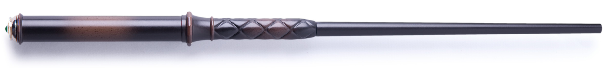

# Kymera Wand

## Table of Contents
- [Meet the Kymera Wand](#meet-the-kymera-wand)
- [IR receiver](#ir-receiver)
- [Automation blueprint](#automation-blueprint)
- [Final notes](#final-notes)
- [Donations](#donations)

## Meet the Kymera Wand

"The Wand Company" is a delightful and imaginative brand that specializes in creating enchanting wands for the modern witch, wizard, or anyone who wants to add a touch of magic to their daily life.

My hardcore Harry Potter fan of a kid's favourite is, of course, the "Kymera Wand", the world’s first real magic wand:

Link: [Kymera Wand universal remote control](https://www.thewandcompany.com/kymera-wand/)

This nifty little device recognizes 13 different motions and emits a different IR signal for each motion. The actual signals can be taught when in learn mode.

## IR Receiver

For a receiver, I setup an [M5STACK STAMP-C3U](https://docs.m5stack.com/en/core/stamp_c3u) I had lying around and added a simple IR receiver to GPIO 3.

Here's my ESPHome configuration: [kymera-wand-esphome.yaml](./kymera-wand-esphome.yaml)

The configuration sets up 13 binary sensors, one for each IR signal associated to wand motions, as well as a text sensor containing the last command received (the motion name, such as "Rotate anticlockwise"). From this, it's easy to setup any type of automation.

In this example, I chose to use well-known Samsung IR codes (numbers 0 to 9, "-", "Mute" and "Previous channel"). These codes are very simple and easy to recognize with virtually no false-positives or misses. You'll need a physical Samsung remote to teach your Kymera Wand or a programmable IR blaster, such as a [BroadLink RM4 Pro IR/RF universal remote](https://www.ibroadlink.com/productinfo/762672.html). You can also reprogram each sensor to match your own signals.

## Automation blueprint

It's relatively easy to setup automations around the receiver's binary sensors but having a long list of automations tends to get messy. To avoid this, I've setup a simple automation blueprint that lets you assign a list of actions to each individual motion: simple and clean. It's also easy for my kid to have full control of each motion's effect without risking to break anything.

Here's the blueprint: [kymera-wand-blueprint.yaml](./kymera-wand-blueprint.yaml)

## Final notes

If you implement this as-is, a variation, or it inspires a completely new project, please let me know so I can share the joy.

# Donations

---

This project is licensed under the terms of the GPL v3.0 license.
